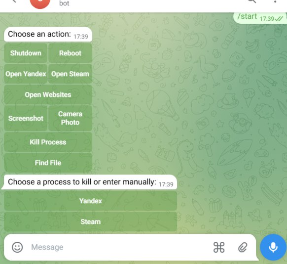

🤖 Telegram Remote PC Control Bot


✨ Features

- ✅ Secure access – only allowed Telegram users can control the PC
- 📁 Find and send files using Everything HTTP or traditional search
- 📸 Screenshot and webcam photo sent directly to Telegram
- 💥 Kill any process (from list or by name)
- 🌐 Open apps and websites (Yandex, Steam, Telegram Web, etc.)
- 🔌 Shutdown / Reboot instantly
- 🖱️ Clean inline interface with minimal delay

---



---
 ⚙️ Requirements

- Windows 10/11
- Python 3.10+
- [Everything](https://www.voidtools.com/downloads/) installed and HTTP server enabled on port 80 *(optional but recommended)*

---
📦 Installation Guide

1. 🧬 Clone the repo

```bash
git clone https://github.com/reasedy/Telegram-pc-control-bot.git
cd telegram-remote-pc-bot
```

02. 📥 Install dependencies

```bash
pip install -r requirements.txt
```

3. ⚙️ Configuration

Open `main.py` and edit:

```python
TOKEN = 'YOUR_BOT_TOKEN_HERE'          # Replace with your actual Telegram bot token
ALLOWED_USER_ID = 1234567890           # Your Telegram user ID
```

Also, update paths in these parts for your local apps:

```python
"C:\\Users\\YOUR_USERNAME\\AppData\\Local\\Yandex\\YandexBrowser\\Application\\browser.exe"
"C:\\Program Files (x86)\\Steam\\Steam.exe"
```

---

4. 🧪 Test it

Run the bot locally:

```bash
python main.py
```

If everything works, you can now build an executable and set up autostart.

---

🛠️ Creating a Standalone .exe App (Optional but Recommended)

To make the bot persistent and easily deployable:

1. 🧊 Install PyInstaller

```bash
pip install pyinstaller
```

2. 🎯 Build the .exe

```bash
pyinstaller --onefile --noconsole main.py
```

After building, find the `.exe` in `dist/main.exe`.


---
🚀 Autostart on Boot (Two methods)

🔁 Option 1: Shell\:Startup (user startup folder)

1. Press `Win + R`, type `shell:startup`, hit Enter.
2. Paste a shortcut to `main.exe` into this folder.

🛡 Option 2: System-wide Registry-based Startup

1. Move `main.exe` to a persistent location (e.g., `C:\ProgramData\SystemAgent\main.exe`).
2. Press `Win + R`, type `regedit`, go to:

```
HKEY_CURRENT_USER\Software\Microsoft\Windows\CurrentVersion\Run
```

3. Create a new `String Value`:

* Name: `SystemAgent`
* Value: `C:\ProgramData\SystemAgent\main.exe`

> This ensures the bot launches every time you start your PC – silently and without flashing a console window.


---
🔐 Security Notes

* Only the user with the specified `ALLOWED_USER_ID` can control the bot.
* If another user sends commands, they will be ignored.
* Keep your `.exe` and bot token private!
---


| Command / Action        | Description                                                                         |
| ----------------------- | ----------------------------------------------------------------------------------- |
| `/start`                | Launches the interactive control panel with all available actions                   |
| **🔎 Find File**        | Prompts you to enter a file name or full path; searches with Everything or fallback |
| **💀 Kill Process**     | Choose from a list of common apps or manually enter the process name                |
| **📸 Screenshot**       | Instantly captures a screenshot of the current display and sends it to Telegram     |
| **📷 Webcam Photo**     | Captures a photo from the PC webcam and sends it                                    |
| **🌐 Open Yandex**      | Opens the Yandex Browser                                                            |
| **🎮 Open Steam**       | Launches the Steam client                                                           |
| **📲 Open Sites**       | Opens Telegram Web and WhatsApp Web via browser                                     |
| **⛔ Shutdown / Reboot** | Remotely shut down or restart your computer                                        |


Made by Raymon
